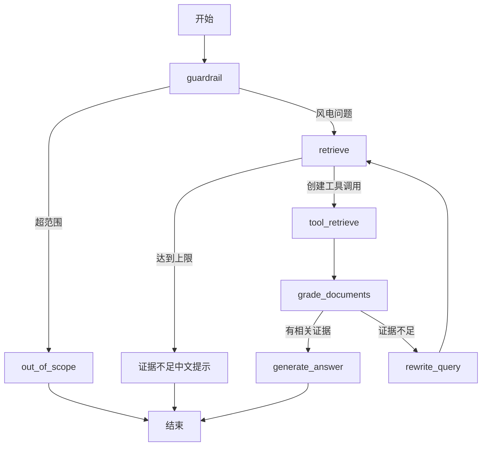

# Agentic RAG工作流

## Agentic RAG解决什么问题

固定 RAG 每次执行同一条链路。Agentic RAG 使用状态、节点和条件路由决定：

- 问题是否属于系统范围；
- 是否发起检索；
- 检索证据是否相关；
- 是否改写 query 再检索；
- 何时生成答案或返回兜底结果。

代价是链路更长，成本、延迟、循环控制和可观测性更复杂。是否使用 Agent 应由业务路由需求决定，而不是为了增加节点数量。

## 项目当前LangGraph

源码注册七个节点：

1. `guardrail`：用 LLM 评分判断问题是否属于风电设备、运维和故障诊断范围；
2. `out_of_scope`：对超范围问题返回简体中文说明；
3. `retrieve`：记录检索次数并创建 `retrieve_wind_documents` 工具调用；
4. `tool_retrieve`：执行 OpenSearch 检索并整理来源；
5. `grade_documents`：逐条判断候选证据相关性；
6. `rewrite_query`：没有相关证据时用风电术语改写原始问题；
7. `generate_answer`：只基于通过评分的证据生成回答。

当前流程：



默认配置：

| 参数 | 默认值 |
| --- | --- |
| `max_retrieval_attempts` | 2 |
| `guardrail_threshold` | 60 |
| `top_k` | 3 |
| `use_hybrid` | true |

源码位置：

- `src/services/agents/agentic_rag.py`
- `src/services/agents/nodes/`
- `src/services/agents/prompts.py`
- `src/services/agents/tools.py`
- `src/services/agents/config.py`

## 查询状态如何流转

状态中保存：

- 对话消息；
- 原始问题和改写问题；
- 检索次数；
- 守卫结果；
- 工具返回的文档；
- 来源信息；
- 文档评分结果；
- 搜索模式和命中数量等 metadata。

`retrieve` 第一次执行时保存 `original_query`。改写节点始终基于原始问题生成更适合风电检索的表达，避免多轮改写不断偏离用户意图。

## 检索工具

`retrieve_wind_documents` 接收 query，并使用运行时配置：

- Top-K；
- 是否启用混合检索；
- `kb_id`、文档类型、风场、风机型号、部件、故障码过滤；
- 可信 `AccessContext`。

启用混合检索时生成 query embedding；Embedding 失败会回退 BM25。OpenSearch 执行失败抛出 `SearchExecutionError`，由 Agent API 转换为 503。

## 文档评分与Reranker的区别

`grade_documents` 使用 LLM 逐条输出相关性判断，并决定进入生成还是 query rewrite。评分服务异常时，当前实现会按“非空证据”做回退判断。

它的作用是 Agent 路由和证据过滤，不应直接称为 Cross-Encoder Reranker。专用 Reranker 通常对 query-document 对输出排序分数，重点是精排；LLM 节点还承担解释和流程决策。

## 循环保护和兜底

当前通过 `retrieval_attempts` 限制循环。达到最大次数后，`retrieve` 不再创建工具调用，而是返回：

```text
当前知识库证据不足。请补充设备型号、部件、故障码、故障现象、运行工况和时间范围后重试。
```

因此项目已经有证据不足行为，但它位于 `retrieve` 节点内部，不是独立的 `insufficient_evidence` 节点。

还可以继续增加：

- 工作流总耗时预算；
- Token 和模型调用预算；
- 单节点超时；
- Query Rewrite 重复度检查；
- 按 query 类型统计改写率和兜底率。

## 当前未实现

- 网页搜索节点；
- 独立证据不足节点；
- 多知识库 Query Router；
- 长期 Memory；
- 专用 Cross-Encoder Reranker；
- 工作流总 Token/耗时预算。

## 为什么当前不直接增加网页搜索

本地风电知识库优先保证内部文档的解析、权限和证据链。网页搜索会额外引入：

- 来源可信度和时效性；
- 网页正文抽取；
- 外部内容的提示注入；
- URL、抓取时间和引用保存；
- 内外部证据冲突。

在没有明确业务需求和评估标准前，不增加网页节点比留下未验证的复杂链路更合理。

## 如何评估Agentic RAG是否值得

至少比较固定 RAG 与 Agentic RAG：

- Recall@K、MRR 和最终答案质量；
- Query Rewrite 后新增的正确召回；
- 无答案问题的误答率；
- 平均和 P95 延迟；
- LLM 调用次数和 Token；
- 改写率、重试率和兜底率；
- 因错误评分丢失正确证据的比例。

没有这些数据时，只能说明 Agent 工作流已实现，不能证明它优于固定 RAG。

## 关联笔记

- [[01-RAG基础概念与常见形态|RAG基础概念与常见形态]]
- [[07-混合检索与结果融合|混合检索与结果融合]]
- [[09-RAG评估与可观测性|RAG评估与可观测性]]
- [[03-项目复盘/RAG项目/源码核验记录|RAG项目源码核验记录]]

## 顺序导航

- 上一节：[[07-混合检索与结果融合|混合检索与结果融合]]
- 下一节：[[09-RAG评估与可观测性|RAG评估与可观测性]]
