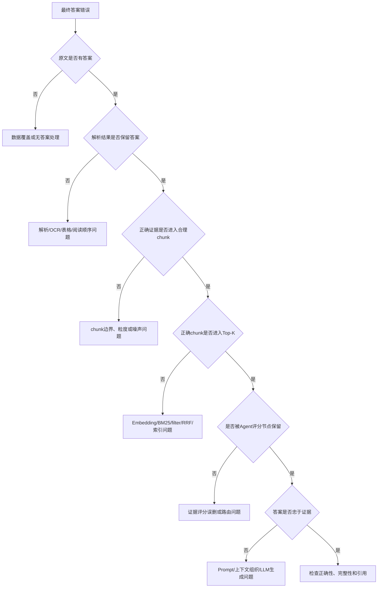

# RAG问题定位与评估面试问答

## 核心原则

评估的价值不只是给系统打分，而是将“答案不好”拆成可定位的组件问题。

```text
原始数据
→ 文档解析
→ chunk
→ 召回与排序
→ Agent证据过滤
→ Prompt与上下文组织
→ LLM生成
→ 引用与兜底
```

只看最终答案，无法知道应该修改哪一层。

## 问题定位决策树



## 如何证明混合检索比纯向量更好

### 回答

> 先固定风电评估集、chunk、Embedding、Top-K 和 filter，分别运行 BM25、纯向量和 RRF 混合检索。整体比较 Recall@K、MRR、nDCG@K 和延迟，再按故障码、自然语言、表格和无答案问题分组。如果混合检索只提高了总平均分，但故障码类问题下降，就还不能直接认为它全面更好。

### 追问：为什么不只看Recall@5

> Recall@5 只能表示已标注相关证据的覆盖情况，不能表示第一个核心证据是否靠前，也不能表示 Top-5 噪声有多少。因此还需要结合 MRR、Precision@K、nDCG@K 和最终生成质量。

## 如何判断是Embedding问题还是chunk问题

### 回答

> 我会先人工检查目标 chunk 是否能独立支持答案。如果正确内容被切散、一个 chunk 混入多个主题，或总缺少前后文，更像 chunk 问题。如果 chunk 本身完整，但同义问法持续无法召回，更像 Embedding 领域适配问题。排查时还要排除 metadata filter、权限、索引版本和 RRF 融合的影响。

## Query Rewrite到底有没有价值

### 回答

> 我会对同一批触发改写的问题，记录改写前后 Recall@K、MRR、第一个正确证据排名、延迟和 Token，并检查改写是否偏离原始意图。如果只是语句更专业，但检索没有提升，就不能认为改写有效。

### 追问：什么是Rewrite Success Rate

> 可以定义为改写后检索指标实际提升的问题数，除以全部触发改写的问题数。但“提升”需要事先固定判定标准，例如 Recall@5 提高或首个正确证据排名前移。

## Faithfulness和Correctness有什么区别

### 回答

> Faithfulness 关心答案结论是否受当前检索证据支持，Correctness 关心答案是否符合参考事实。模型可能凭自身记忆给出一个正确但无检索证据支持的答案，这时 Correctness 可能高，Faithfulness 低。它也可能忠实复述一段错误资料，这时 Faithfulness 高，Correctness 低。

## 没有标准答案怎么评估

### 回答

> 没有完整参考答案时，仍可以标注相关文档或 chunk，先做检索评估；生成层可以检查 Faithfulness、引用正确性和是否直接回答问题。还可以把参考答案换成关键要点，或对高价值样本进行人工复核。缺少真值时不应强行给出伪精确的 Correctness 分数。

## 为什么不能只用Ragas

### 回答

> Ragas 是评估框架，不是真值本身。它的部分指标依赖 LLM-as-a-Judge，会受评估模型、Prompt、版本和领域知识影响。我会把 Ragas 用于离线批量回放，但同时保留可确定计算的检索指标、Langfuse trace 和人工抽样复核。

## 自动评估和人工评估怎么结合

### 回答

> Recall、MRR、nDCG、延迟和 Token 可以直接计算；Faithfulness、Answer Relevance 和完整性可以使用结构化 LLM Judge 批量评估；风电专业术语、复杂表格、故障排查顺序和 Judge 分歧样本再由人工复核。我还会用人工标注的小集合先检查 Judge 与人的一致性。

## 离线评估很好，线上反馈很差怎么办

### 回答

> 先检查离线数据集是否代表真实 query 分布，是否缺少口语表达、模糊问题、长尾故障和无答案问题。然后通过 Langfuse 将差评 trace 按问题类型和失败节点分组，把有代表性的线上失败样本经人工确认后加入回归集。离线评估集不是一次性的，而应该随真实失败持续更新。

## 如何评估无答案问题

### 回答

> 评估集会显式标记 `answerable`。对无答案问题统计强行回答和编造细节的误答率；对有答案问题统计证据已存在但系统仍兜底的错误拒答率。同时检查兜底是否能指导用户补充设备型号、故障码和运行工况。

## 项目评估完整回答

> 我会把评估拆成解析、chunk、检索、生成和 Agent 五层。解析层检查阅读顺序、表格结构和 sections 缺失；chunk 层统计长度分布、fallback 比例并抽样语义完整性。检索层建立带相关文档或 chunk 标注的风电问题集，通过 Recall@K、MRR 和 nDCG@K 对比 BM25、纯向量和 RRF。生成层关注 Faithfulness、Answer Relevance、Correctness、完整性和引用正确性。Agent 还要单独评估守卫误判、Query Rewrite 前后的检索增益、证据误删率、检索次数、P95 延迟和 Token。最后用 Langfuse 保留每次请求的链路，把自动指标、LLM Judge 和人工抽样结合起来。

## 当前项目的准确口径

> 当前项目已经完成 Langfuse 链路观测和自动化代码测试，但还没有建立正式风电评估集，也没有形成 BM25、纯向量、RRF 和 Query Rewrite 的实验对比报告。因此我可以说明完整评估方案和问题定位方法，但不把尚未执行的实验写成已有效果结论。

## 自测清单

- [ ] 能解释 Hit Rate@K、Recall@K、Precision@K、MRR 和 nDCG@K 的区别
- [ ] 能解释 Faithfulness 和 Correctness 为什么不同
- [ ] 能设计有答案、无答案和超范围评估样本
- [ ] 能解释为什么需要基线和单变量实验
- [ ] 能解释 Query Rewrite 的质量收益和成本取舍
- [ ] 能解释 LLM Judge 的偏差和人工校准方法
- [ ] 能按解析、chunk、检索、Agent 和生成定位失败
- [ ] 能在 2 分钟内说清项目的完整评估设计

## 关联笔记

- [[09-RAG评估与可观测性|RAG评估与可观测性]]
- [[09-1-RAG评估集与实验设计|RAG评估集与实验设计]]
- [[09-2-RAG检索评估指标|RAG检索评估指标]]
- [[09-3-RAG生成与引用评估|RAG生成与引用评估]]
- [[09-4-Agentic RAG评估|Agentic RAG评估]]
- [[03-项目复盘/RAG项目/面试问答|RAG项目面试问答]]

## 顺序导航

- 上一节：[[09-4-Agentic RAG评估|Agentic RAG评估]]
- 返回专题首页：[[09-RAG评估与可观测性|RAG评估与可观测性]]
- 下一主节：[[10-RAG知识增强与面试问题清单|RAG知识增强与面试问题清单]]

